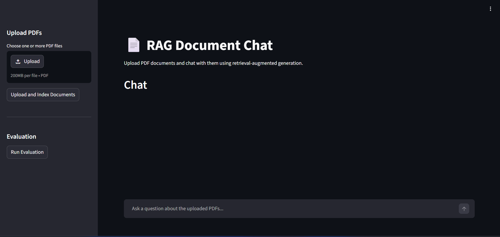
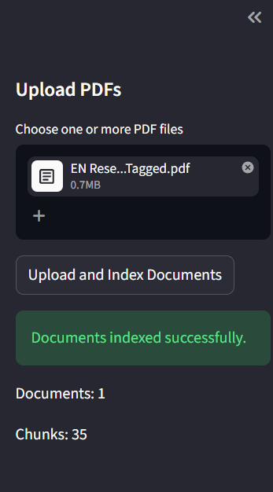
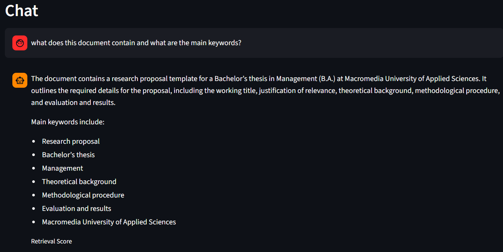
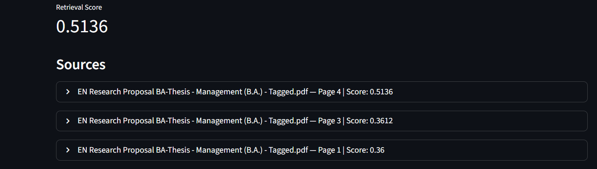

## RAG Document Chat

A Retrieval-Augmented Generation (RAG) web application that allows users to upload one or more PDF documents and chat with their contents. The system extracts text from uploaded PDFs, splits it into overlapping chunks, generates embeddings, stores them in a FAISS vector index, retrieves and re-ranks the most relevant chunks, and uses an LLM to generate grounded answers with source attribution.

---

## Screenshots

### Main Interface


### Document Upload and Indexing


### Chat Response with Source Attribution


### Automated Evaluation



## Live Demo

https://rag-document-chat-production-b32b.up.railway.app/

## Features

- Upload multiple PDF documents
- Automatic PDF text extraction
- Text chunking with overlap
- Embedding generation using Sentence Transformers
- Vector similarity search using FAISS
- LLM-based question answering via OpenRouter
- Source attribution (document name, page number, and preview)
- BM25 re-ranking of retrieved chunks before the LLM call
- Retrieval score display
- Five automated evaluation questions with expected answers
- FastAPI backend
- Streamlit frontend
- Docker Compose deployment

---

## Tech Stack

- Python 3.11
- FastAPI
- Streamlit
- Sentence Transformers (`all-MiniLM-L6-v2`)
- FAISS
- BM25 (`rank-bm25`)
- OpenRouter (OpenAI-compatible API)
- Docker & Docker Compose

---

## Architecture

1. User uploads one or more PDF documents.
2. The backend extracts text and metadata (document name and page number).
3. Text is split into overlapping chunks.
4. Each chunk is converted into a dense embedding vector.
5. Embeddings are stored in a FAISS vector index.
6. When the user asks a question, the query is embedded.
7. FAISS retrieves candidate chunks using semantic similarity.
8. Retrieved chunks are re-ranked using BM25 lexical relevance.
9. The top-ranked chunks are passed to the LLM as context.
10. The model generates an answer grounded in the retrieved sources.
11. The frontend displays the answer, retrieval score, and source citations.

---

## Chunking Strategy

The application uses fixed-size text chunks with overlap.

- Chunk size: 800 characters
- Overlap: 150 characters

## Re-ranking

The system uses a two-stage retrieval pipeline.

First, FAISS retrieves a larger set of candidate chunks based on semantic similarity. Then, the retrieved chunks are re-ranked using BM25 lexical relevance. The final score combines both signals:

- 70% semantic similarity
- 30% BM25 lexical relevance

This improves retrieval quality because semantic search captures meaning, while BM25 helps prioritize chunks that contain important query terms.

The final top-ranked chunks are passed to the LLM for grounded answer generation.

### Why Chunking Is Necessary

Large language models and embedding models perform better when documents are divided into smaller semantic units. Chunking ensures that relevant information can be retrieved efficiently without embedding entire documents.

### Why Overlap Improves Retrieval Quality

Important information often spans chunk boundaries. Using overlap preserves context between neighboring chunks and reduces the chance that key sentences are split apart, which improves retrieval relevance and answer quality.

### Trade-offs

- Smaller chunks increase retrieval precision but may lose context.
- Larger chunks preserve more context but may introduce irrelevant information.
- Overlap increases redundancy slightly but significantly improves robustness.

---

## Storage Strategy

Uploaded PDFs are stored temporarily in `backend/uploads/` for processing. This directory is excluded from version control using `.gitignore`.

For a production deployment, file storage would be replaced by object storage such as Amazon S3 or MinIO, with metadata stored in PostgreSQL and vector embeddings persisted using pgvector or a dedicated vector database.

---

## Error Handling

The backend returns clear HTTP errors for common failure cases, such as uploading invalid files, asking questions before indexing documents, or processing PDFs without readable text.

## Live Demo

https://rag-document-chat-production-b32b.up.railway.app/

## Evaluation

The application includes five hardcoded test questions with expected answers. For each question, the system retrieves the top matching chunks and computes a retrieval score based on vector similarity. The score and top source are displayed in the user interface.

---

## Project Structure

```text
rag-document-chat/
├── backend/
│   ├── Dockerfile
│   ├── main.py
│   ├── rag.py
│   ├── requirements.txt
│   └── uploads/
├── frontend/
│   ├── Dockerfile
│   ├── app.py
│   └── requirements.txt
├── docker-compose.yml
├── README.md
├── .gitignore
└── .env
